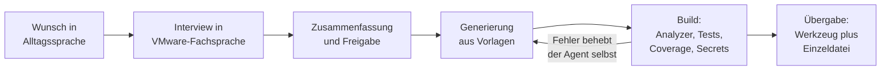

<div align="center">

# ps-script-machine

**Entwicklungsplattform für hochwertige PowerShell- und PowerCLI-Werkzeuge –
gebaut von KI-Agenten, geprüft durch harte Qualitätsschranken.**

[](https://github.com/spiral023/ps-script-machine/actions/workflows/ci.yml)
[](https://opensource.org/licenses/MIT)
[](https://docs.microsoft.com/en-us/powershell/)
[](https://developer.vmware.com/powercli)
[](#qualitätssicherung)

</div>

---

Ein VMware-Administrator beschreibt sein Werkzeug in normalem Deutsch. Der KI-Agent
fragt in VMware-Fachsprache nach, lässt sich das Ergebnis freigeben und liefert ein
fertiges, getestetes Skript – ohne dass der Administrator eine Zeile Code liest.

Damit dabei nichts Halbfertiges entsteht, ist die Qualität nicht dem Zufall überlassen:
Die verbindliche Regelbasis in **[AGENTS.md](AGENTS.md)** bindet jeden Agenten, und der
Build blockiert, wenn eine Schranke reißt.

> [!TIP]
> **Neu hier oder am Abwägen, ob sich der Ansatz lohnt?**
> [**docs/NUTZEN_UEBERBLICK.md**](docs/NUTZEN_UEBERBLICK.md) erklärt Nutzen,
> Praxisablauf und Standards ohne technische Vorkenntnisse – für Admins und
> Entscheider.

## Inhalt

| Für wen | Wo einsteigen |
| --- | --- |
| **VMware-Admin ohne Programmierkenntnisse** | [Schnellstart](#schnellstart) → [Skript-Werkstatt](#skript-werkstatt-vom-satz-zum-werkzeug) |
| **PowerShell-Entwickler / DevOps** | [Installation](#installation) → [Modulfunktionen](#modulfunktionen) → [Qualitätssicherung](#qualitätssicherung) |
| **Entscheider / Fachvorgesetzte** | [docs/NUTZEN_UEBERBLICK.md](docs/NUTZEN_UEBERBLICK.md) |
| **Coding Agent** | [AGENTS.md](AGENTS.md) – zentrale Regelbasis |

Weitere Abschnitte: [Ausbaustufen](#die-zwei-ausbaustufen) ·
[Voraussetzungen](#voraussetzungen) · [Verwendung](#verwendung) ·
[Neue Funktion erstellen](#neue-funktion-erstellen) · [Sicherheit](#sicherheit) ·
[Tests](#tests) · [Projektstruktur](#projektstruktur) ·
[Bekannte Einschränkungen](#bekannte-einschränkungen)

---

## Schnellstart

Drei Wege, je nachdem was gebraucht wird:

<table>
<tr>
<th>Ich brauche ein Werkzeug</th>
<th>Ich will das Modul nutzen</th>
<th>Ich brauche ein Einzelskript</th>
</tr>
<tr>
<td valign="top">

Beschreiben – in eigenen Worten,
im Chat mit dem Coding Agent:

> „Schreibe ein Skript, das die
> CDP-Daten aller ESXi-Netzwerk-
> interfaces von allen Hosts aus
> einem oder mehreren vCentern
> ausliest und als CSV speichert."

→ [Skript-Werkstatt](#skript-werkstatt-vom-satz-zum-werkzeug)

</td>
<td valign="top">

```powershell
git clone https://github.com/spiral023/ps-script-machine.git
cd ps-script-machine
Import-Module .\src\ps-script-machine\ps-script-machine.psd1
Get-Command -Module ps-script-machine
```

→ [Verwendung](#verwendung)

</td>
<td valign="top">

Ohne Repository, ohne Build,
domänenübergreifend – der
**Light-Skill**:

`packages/skills/`
`powershell-skript-werkstatt-light.zip`

Importierbar in Claude Code
**und ChatGPT**.

→ [Ausbaustufen](#die-zwei-ausbaustufen)

</td>
</tr>
</table>

---

## Skript-Werkstatt: vom Satz zum Werkzeug



Der Ablauf ist in [`.agents/skills/script-werkstatt/SKILL.md`](.agents/skills/script-werkstatt/SKILL.md)
festgelegt. Vier Eigenschaften machen den Unterschied:

- **Fachsprache statt Code-Sprache.** Gefragt wird nach Hosts, Clustern, Portgroups und
  Datastores – nie nach Parametertypen oder Funktionen.
- **Die Freigabe ist die Vertragsstelle.** Vor dem Bauen wird zusammengefasst:
  Geltungsbereich, Ausgabeformat und -ort, Verhalten bei nicht erreichbaren Servern,
  Betriebsprofil, Protokollierung, Exitcodes. Am Ende wird das Ergebnis Satz für Satz
  gegen genau diese Zusage geprüft.
- **Build-Fehler behebt der Agent selbst.** Der Administrator sieht davon nichts.
- **Jedes Werkzeug ist weitergabefähig.** Erzeugte Wrapper liegen in `scripts/tools/`
  und werden zusätzlich als eigenständige Einzeldatei gebündelt.

Jeder erzeugte Wrapper führt durch denselben Ablauf: vCenter-Auswahl (gespeicherte Liste
in `config/vcenters.json` plus Freitext), **einmalige** Anmeldung für alle vCenter mit
gezielter Wiederholung pro Server im Fehlerfall, werkzeugspezifische Fragen,
Fortschrittsanzeige und Abschlussübersicht mit Ausgabepfaden. Nicht erreichbare vCenter
werden übersprungen und ausgewiesen – sie brechen den Lauf nie ab.

```powershell
# Bündelt jeden Wrapper als eigenständige Einzeldatei nach build/standalone/
.\scripts\Invoke-Build.ps1 -Task Standalone
```

Die Einzeldatei läuft auf jedem Rechner mit PowerShell 7.4+ und PowerCLI – **ohne dieses
Repository**.

---

## Die zwei Ausbaustufen

|  | **Vollvariante** (dieses Repository) | **Light-Variante** (Skill-Paket) |
| --- | --- | --- |
| **Ergebnis** | Modulfunktion + interaktiver Wrapper + Tests + Doku | Eine einzelne, eigenständige `.ps1` |
| **Voraussetzungen** | Repository, Pester, PSScriptAnalyzer, Build | Keine – nur PowerShell selbst |
| **Qualitätsprüfung** | Automatisiert (Analyzer, Tests, ≥ 80 % Abdeckung, Secret-Scan, Compliance) | Selbstprüfung mit Bordmitteln: Syntax-Parser, Trockenlauf, Grenzfälle, Checkliste |
| **Domäne** | VMware / vSphere | Domänenneutral: Dateisystem, AD, Netzwerk, Cloud, Datenbanken, REST-APIs, VMware |
| **Ideal für** | Werkzeuge, die bleiben und wachsen | Den Einzelfall, der heute gebraucht wird |
| **Nutzbar in** | Claude Code / Copilot im Repository | Claude Code **und ChatGPT** |
| **Definition** | [AGENTS.md](AGENTS.md) + [script-werkstatt](.agents/skills/script-werkstatt/SKILL.md) | [powershell-skript-werkstatt-light](.agents/skills/powershell-skript-werkstatt-light/SKILL.md) |

> [!IMPORTANT]
> Die Light-Variante senkt die Einstiegshürde, **nicht den Anspruch**. Ohne Testframework
> gelten dieselben Sicherheitsregeln, dieselbe Struktur und derselbe Betriebs- und
> Laufzeitvertrag. Was wegfällt, ist die Werkzeugkette – nicht die Sorgfalt.

**Import in ChatGPT:** `packages/skills/powershell-skript-werkstatt-light.zip` als Skill
hochladen. Damit erzeugen auch Kollegen ohne Repository-Zugang Skripte nach
Hausstandard – der Standard reist im Paket mit.

---

## Voraussetzungen

| Komponente | Version |
| --- | --- |
| PowerShell | 7.4 oder neuer |
| PowerCLI | 13.2.0 oder neuer |
| Pester | 5.0 oder neuer *(nur für Entwicklung)* |
| PSScriptAnalyzer | aktuell *(nur für Entwicklung)* |
| vCenter | 7.0, 8.0 |
| ESXi | 7.0, 8.0 |

---

## Installation

```powershell
# 1. Repository holen
git clone https://github.com/spiral023/ps-script-machine.git
cd ps-script-machine

# 2. Modul importieren und prüfen
Import-Module .\src\ps-script-machine\ps-script-machine.psd1
Get-Command -Module ps-script-machine
```

<details>
<summary><b>Abhängigkeiten installieren</b></summary>

```powershell
# Laufzeit
Install-Module VMware.PowerCLI -Scope CurrentUser

# Entwicklung
Install-Module Pester -MinimumVersion 5.0 -Scope CurrentUser
Install-Module PSScriptAnalyzer -Scope CurrentUser
```

</details>

---

## Modulfunktionen

| Funktion | Art | Zweck |
| --- | --- | --- |
| [`Connect-MultiVIServer`](docs/Connect-MultiVIServer.md) | Verbindung | Einmal Zugangsdaten, beliebig viele vCenter. Fehlgeschlagene Server landen in `Skipped` und brechen den Lauf nie ab; für Automatisierung `-NonInteractive`. |
| [`Select-VIServerTarget`](docs/Select-VIServerTarget.md) | Interaktiv | Auswahlmenü aus `config/vcenters.json`: Nummern, `alle` oder FQDN-Freitext. Neue FQDNs sind auf Nachfrage speicherbar. |
| [`Get-CdpNetworkInfo`](docs/Get-CdpNetworkInfo.md) | Read-only | CDP-Daten je Host und Adapter aus einer Session – optional gefiltert nach Hosts, optional mit Detailtiefe. |
| [`Get-VMHostNetworkInfo`](docs/Get-VMHostNetworkInfo.md) | Read-only | CDP-/LLDP-Netzwerkhinweise physischer Adapter über **mehrere** Sessions, filterbar nach Host oder Cluster. |
| [`Export-ModuleData`](docs/Export-ModuleData.md) | Export | Export nach CSV und/oder JSON. Legt das Zielverzeichnis an und gibt die vollständigen Pfade zurück. |

Alle lesenden Funktionen übergeben `-Server` **explizit** an jedes PowerCLI-Cmdlet und
verlassen sich nie auf eine globale Standardverbindung. Sessions werden vom Aufrufer
erzeugt und geschlossen – die Funktionen fassen fremde Verbindungen nicht an
(siehe [ADR 0001](.agents/adr/0001-viserver-session-statt-server-credential.md)).

---

## Verwendung

```powershell
Import-Module .\src\ps-script-machine\ps-script-machine.psd1

$connection = $null
try {
    # Zugangsdaten niemals fest codieren - einmal fragen, für alle vCenter nutzen
    $connection = Connect-MultiVIServer -Server 'vc01.example.local', 'vc02.example.local'

    if ($connection.Skipped) {
        Write-Warning "Übersprungen: $($connection.Skipped -join ', ')"
    }

    # Auswertung über alle verbundenen Sessions
    $cdpInfo = foreach ($session in $connection.Sessions) {
        Get-CdpNetworkInfo -VIServer $session
    }

    # Export - der vollständige Pfad kommt zurück
    Export-ModuleData -Data $cdpInfo -OutputPath "$HOME\Desktop\cdp-info" -Format CSV, JSON -Force
}
finally {
    if ($connection.Sessions) {
        Disconnect-VIServer -Server $connection.Sessions -Confirm:$false -ErrorAction SilentlyContinue
    }
}
```

Ein vollständiges Beispiel liegt in [`examples/`](examples/), ein produktives Werkzeug in
[`scripts/tools/Export-CdpInformation.ps1`](scripts/tools/Export-CdpInformation.ps1).

---

## Qualitätssicherung

[AGENTS.md](AGENTS.md) ist die maßgebliche Quelle für alle Standards und Schwellwerte –
dieser Abschnitt fasst nur zusammen, was der Build automatisch erzwingt.

```powershell
.\scripts\Invoke-Build.ps1          # alle Tasks
.\scripts\Invoke-Build.ps1 -CI      # CI-Modus: Analyzer-Warnungen sind fatal
```

| Task | Prüft |
| --- | --- |
| `Manifest` | Modulmanifest ist valide |
| `Analyze` | PSScriptAnalyzer – **null** Error/Warning in `src/ps-script-machine/` |
| `Test` | Pester-5-Unit-Tests |
| `Coverage` | Code-Abdeckung **≥ 80 %** (0 % lässt den Build scheitern) |
| `Docs` | Dokumentation zu jeder öffentlichen Funktion vorhanden |
| `Build` | Modul-Build nach `build/output/` |
| `Standalone` | Wrapper-Bündelung nach `build/standalone/` |
| `Secrets` | Scan auf versehentlich eingecheckte Zugangsdaten |
| `Compliance` | Abgleich gegen die Regelbasis in `AGENTS.md` |
| `All` | alles oben, in dieser Reihenfolge *(Standard)* |

Einzeln aufrufbar über `-Task`, Schwelle anpassbar über `-CodeCoverageThreshold 90`.

> [!NOTE]
> Schlägt ein Task fehl, laufen die folgenden nicht mehr an – die Abschlussübersicht
> zeigt aber **jeden** Task als `Passed`, `Failed` oder `Not Run`. So ist sofort sichtbar,
> welche Schranke gerissen ist und welche danach nie erreicht wurde.

**Bewusst ausgenommen:** `scripts/`, `templates/` und `examples/` fallen nicht unter die
strenge Analyzer-Prüfung – interaktive Konsolenwerkzeuge nutzen dort legitim
`Write-Host`, `Read-Host` und `Format-Table`. Details in
[docs/ARCHITECTURE.md](docs/ARCHITECTURE.md).

---

## Neue Funktion erstellen

**Empfohlen – Generator:**

```powershell
.\scripts\New-PowerCLITool.ps1 -FunctionName 'Get-VMHostDetail' -Type ReadOnly `
    -Synopsis 'Liest detaillierte VMHost-Informationen'
```

Erzeugt in einem Schritt Funktion, Test und Dokumentationsgerüst:

```text
src/ps-script-machine/Public/Get-VMHostDetail.ps1
tests/Unit/Get-VMHostDetail.Tests.ps1
docs/Get-VMHostDetail.md
```

`-Type` wählt die Vorlage: `ReadOnly` (kein `SupportsShouldProcess`), `Change`
(mit `SupportsShouldProcess` und `ConfirmImpact`) oder `Private`. Der Generator prüft den
Verb-Noun-Namen gegen die genehmigten Verben, verhindert Path Traversal, überschreibt
nichts ohne `-Force`, unterstützt `-WhatIf` und rollt Teilfehler zurück.

<details>
<summary><b>Manueller Weg und Wrapper-Erstellung</b></summary>

1. [`templates/PublicFunction.ps1`](templates/) kopieren – für verändernde Funktionen
   `SupportsShouldProcess` / `ConfirmImpact = 'High'` ergänzen.
2. Nach `src/ps-script-machine/Public/` legen.
3. Test in `tests/Unit/` aus [`templates/PesterTest.Tests.ps1`](templates/) anlegen.
4. `.\scripts\Invoke-Build.ps1` ausführen.
5. README und `CHANGELOG.md` aktualisieren.

**Wrapper** entstehen ausschließlich aus
[`templates/InteractiveWrapper.ps1`](templates/InteractiveWrapper.ps1). Sie prüfen die
PowerCLI-Mindestversion vor der Fachlogik, nutzen **einen** äußeren
`try`/`catch`/`finally`-Lebenszyklus mit **genau einem** Exitpunkt, schreiben eine
strukturierte Laufzusammenfassung, machen Transcripts optional und dokumentieren ihre
Exitcodes. Verändernde Wrapper reichen `-WhatIf` und `-Confirm` an die verändernde
Modulfunktion durch.

</details>

---

## Sicherheit

Vollständige Richtlinie: [SECURITY.md](SECURITY.md)

| Regel | Was sie verhindert |
| --- | --- |
| Keine fest codierten Zugangsdaten – `PSCredential`, `SecretManagement` | Passwörter, die per Dateifreigabe oder Git weiterwandern |
| Kein `Invoke-Expression` / `iex` | Die häufigste Einladung zur Codeeinschleusung in PowerShell |
| Keine Klartextpasswörter, keine Secrets in Logs | Zugangsdaten, die über Protokolldateien abfließen |
| Keine fest codierten Servernamen, IPs oder Umgebungspfade | Skripte, die nur auf dem Rechner ihres Erfinders laufen |
| Zertifikatsprüfung nie stillschweigend deaktivieren | Unbemerkt aufgeweichte Transportsicherheit |
| Alle Parameter validiert | Fehlerhafte Eingaben, die erst im Ziel auffallen |
| Least Privilege, benötigte Rechte in `.NOTES` | Automatisierung, die aus Bequemlichkeit als Administrator läuft |

Verändernde Werkzeuge bekommen verpflichtend: Vorschau-Lauf (`-WhatIf`), Bestätigung
(`-Confirm`), Vorprüfung, eindeutige Zielvalidierung, Nachprüfung, Vorher-/Nachher-Werte
im Ergebnisobjekt und möglichst idempotentes Verhalten.

<details>
<summary><b>SecretManagement einrichten</b></summary>

```powershell
Install-Module Microsoft.PowerShell.SecretManagement -Scope CurrentUser
Install-Module Microsoft.PowerShell.SecretStore -Scope CurrentUser

Register-SecretVault -Name 'MyVault' -ModuleName 'Microsoft.PowerShell.SecretStore'
Set-Secret -Name 'vcenter-prod' -Secret (Get-Credential) -Vault 'MyVault'

# Im Skript
$credential = Get-Secret -Name 'vcenter-prod' -Vault 'MyVault'
$connection = Connect-MultiVIServer -Server 'vc01.example.local' -Credential $credential
```

</details>

<details>
<summary><b>Benötigte vSphere-Berechtigungen</b></summary>

Für `Get-CdpNetworkInfo` und `Get-VMHostNetworkInfo`:

| Berechtigung | Geltungsbereich |
| --- | --- |
| `System.Read` | vCenter Server |
| `Host.Config.Network` | ESXi-Hosts oder Host-Ordner |

**Empfehlung (Least Privilege):** eine eigene vCenter-Rolle anlegen
(vCenter → Administration → Roles, z. B. `ps-script-machine-readonly`), **nur** diese
beiden Berechtigungen zuweisen und die Rolle dem Dienstkonto geben.

</details>

---

## Protokollierung

Vier Kanäle, strikt getrennt – sie ersetzen einander nicht:

| Kanal | Zweck | Werkzeug |
| --- | --- | --- |
| Rückgabe | Ergebnis für den Aufrufer | `[PSCustomObject]` mit `PSTypeName` |
| Diagnose | Was gerade passiert | `Write-Verbose`, `Write-Warning`, `Write-Error` |
| Export | Ergebnis als Datei | `Export-ModuleData` |
| Log | Nachvollziehbarkeit über die Zeit | `Write-ModuleLog` (strukturiertes JSON) |

Jeder Logeintrag enthält Zeitstempel (UTC, ISO 8601), Level, `RunId`, `VIServer`,
betroffene Ressource, Meldung und optionale Daten:

```powershell
Write-ModuleLog -Message 'Vorgang abgeschlossen' -Level Information `
    -VIServer 'vc01.example.local' -LogFile 'C:\Logs\module.log'
```

Wrapper schreiben zusätzlich eine Laufzusammenfassung mit `RunId`, UTC-Start und -Ende,
Dauer, Status, Exitcode, Ziel- und Fehlerzahlen sowie erzeugten Dateien. Exitcodes:
**`0`** Erfolg oder fachlich behandelter Teilerfolg, **`1`** fataler Fehler.
Abweichende Codes nur nach Abstimmung und dokumentiert in `.NOTES`.

---

## Tests

```powershell
.\scripts\Invoke-Build.ps1 -Task Test        # Unit-Tests
.\scripts\Invoke-Build.ps1 -Task Coverage    # Abdeckung
```

| Ebene | Ort | Eigenschaft |
| --- | --- | --- |
| **Unit** | [`tests/Unit/`](tests/Unit/) | PowerCLI vollständig gemockt, läuft ohne vCenter |
| **Acceptance** | [`tests/Acceptance/`](tests/Acceptance/) | Manifest, Modulimport, Sicherheitsregeln |
| **Integration** | [`tests/Integration/`](tests/Integration/) | Nur nach ausdrücklicher Freischaltung, **niemals** gegen Produktion |

Neben den Funktionstests sichern Vertragstests die Struktur selbst ab: Ergebnisobjekt-
Schema, Wrapper-Lebenszyklus, PowerCLI-Mindestversion, Durchreichen von
`-WhatIf`/`-Confirm` und die Skill-Referenzstruktur.

<details>
<summary><b>Integrationstests aktivieren (nur Lab-Umgebung)</b></summary>

```powershell
$env:PS_SCRIPT_MACHINE_INTEGRATION_TESTS = 'true'
$env:PS_SCRIPT_MACHINE_VCENTER = 'vcenter.test.local'
Invoke-Pester -Path tests/Integration/
```

</details>

---

## Projektstruktur

```text
src/ps-script-machine/
├── Public/                    Exportierte Funktionen
├── Private/                   Interne Helfer (für Tests sichtbar, nicht exportiert)
├── Classes/                   PowerShell-Klassen (optional)
├── ps-script-machine.psd1     Modulmanifest
└── ps-script-machine.psm1     Root-Modul

.agents/
├── skills/                    script-werkstatt, powershell-skript-werkstatt-light,
│                              vmware-powercli-scripts
└── adr/                       Getroffene Architekturentscheidungen

scripts/                       Build- und Generatorskripte
└── tools/                     Erzeugte interaktive Werkzeuge
templates/                     Vorlagen für Funktionen, Wrapper, Tests
tests/                         Unit, Acceptance, Integration
packages/skills/               Upload-fertige Skill-Pakete (.skill / .zip)
config/                        Beispielkonfigurationen
docs/                          Architektur- und Funktionsdokumentation
examples/                      Anwendungsbeispiele
build/                         Build-Ausgabe (gitignored)
.github/                       CI/CD, Issue- und PR-Vorlagen
```

---

## Regeln für Coding Agents

| Datei | Rolle |
| --- | --- |
| **[AGENTS.md](AGENTS.md)** | Zentrale Regelbasis: Versionen, Struktur, Namenskonventionen, Definition of Done, Laufzeitvertrag. **Bei Konflikten gewinnt diese Datei.** |
| [`.agents/skills/vmware-powercli-scripts/`](.agents/skills/vmware-powercli-scripts/) | Vertiefung: PowerCLI-Handwerk mit Falsch-/Richtig-Beispielen und Begründungen |
| [`.agents/skills/script-werkstatt/`](.agents/skills/script-werkstatt/) | Prozess: von der Beschreibung zum fertigen Werkzeug |
| [`.agents/adr/`](.agents/adr/) | Bereits getroffene Entscheidungen – **vor** Änderungen an Verbindungslogik, Wrapper-Aufbau oder Ablageort lesen |
| [CLAUDE.md](CLAUDE.md) · [.github/copilot-instructions.md](.github/copilot-instructions.md) | Agent-spezifische Einstiegspunkte, verweisen auf `AGENTS.md` |

Ergänzend: [docs/DEFINITION_OF_DONE.md](docs/DEFINITION_OF_DONE.md) ·
[docs/CODE_REVIEW_CHECKLIST.md](docs/CODE_REVIEW_CHECKLIST.md) ·
[docs/ARCHITECTURE.md](docs/ARCHITECTURE.md)

---

## Bekannte Einschränkungen

- **PowerCLI erforderlich** – ohne `VMware.PowerCLI` läuft das Modul nicht.
- **Nur vCenter 7.0 / 8.0** – ältere Versionen werden nicht unterstützt.
- **Windows-orientiert** – PowerShell 7.4 ist plattformübergreifend, PowerCLI hat
  jedoch Windows-spezifische Funktionen.
- **Keine PowerShell-Gallery-Veröffentlichung** – Installation erfolgt aus dem Quellcode.
- **Integrationstests brauchen eine Lab-Umgebung** – nicht gegen Produktion ausführbar.
- **`Get-VMHostNetworkInfo` folgt noch nicht dem Standard-Ergebnisschema.** Die
  Umstellung auf `PSTypeName`, `VIServer` statt `vCenter`, `RunId` und `Timestamp` ist
  eine Breaking Change und für v2.0.0 vorgesehen – siehe [CHANGELOG.md](CHANGELOG.md)
  und „Known Deviations" in [docs/ARCHITECTURE.md](docs/ARCHITECTURE.md).

---

## Versionierung und Releases

Dieses Projekt folgt [Semantic Versioning](https://semver.org/) und
[Keep a Changelog](https://keepachangelog.com/de/1.1.0/): **MAJOR** für Breaking
Changes, **MINOR** für neue, abwärtskompatible Funktionen, **PATCH** für Fehlerbehebungen.

Jede nennenswerte Änderung landet unter `## [Unreleased]` in
[CHANGELOG.md](CHANGELOG.md) – für Coding Agents ist das verpflichtender Teil des
Push-Workflows.

<details>
<summary><b>Release-Ablauf</b></summary>

1. `CHANGELOG.md`: `Unreleased`-Einträge unter `## [X.Y.Z] - YYYY-MM-DD` verschieben.
2. Modulversion in `src/ps-script-machine/ps-script-machine.psd1` anheben.
3. `git tag -a v1.0.0 -m "Release v1.0.0"`
4. `git push origin v1.0.0`
5. GitHub Actions erstellt das Release automatisch.

</details>

---

## Mitwirken und Lizenz

Beiträge sind willkommen – Richtlinien in [CONTRIBUTING.md](CONTRIBUTING.md).
Vor jedem Pull Request lokal alle Schranken durchlaufen lassen:

```powershell
.\scripts\Invoke-Build.ps1 -CI
```

Lizenziert unter der MIT-Lizenz – siehe [LICENSE](LICENSE).
